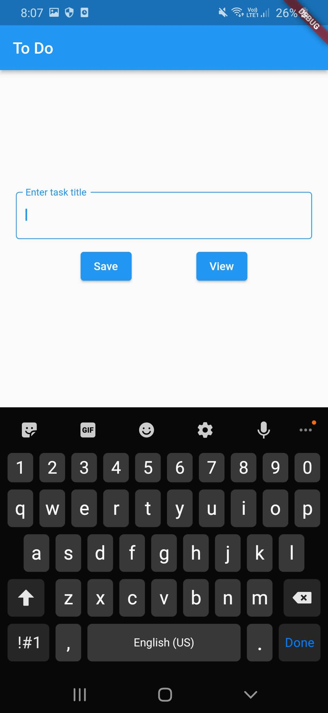
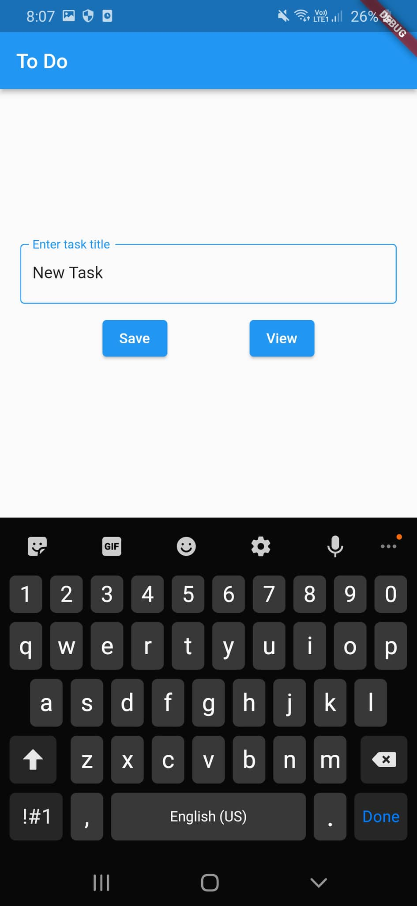
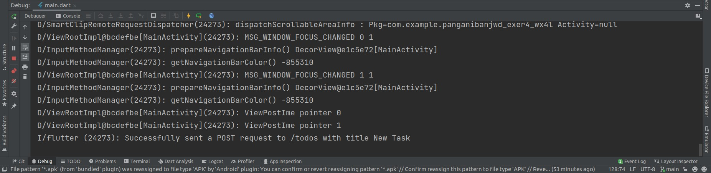
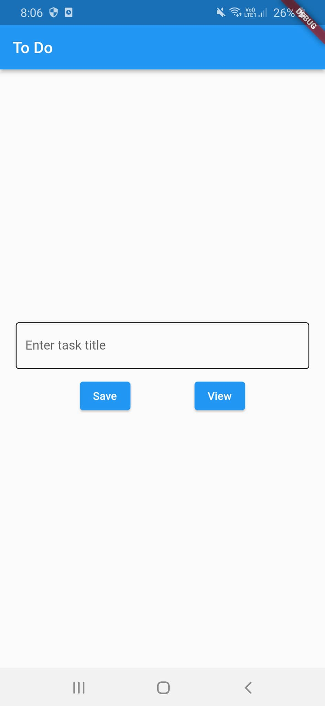
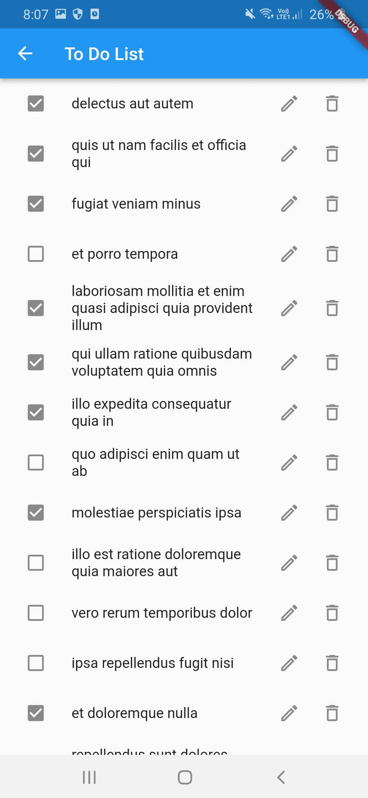
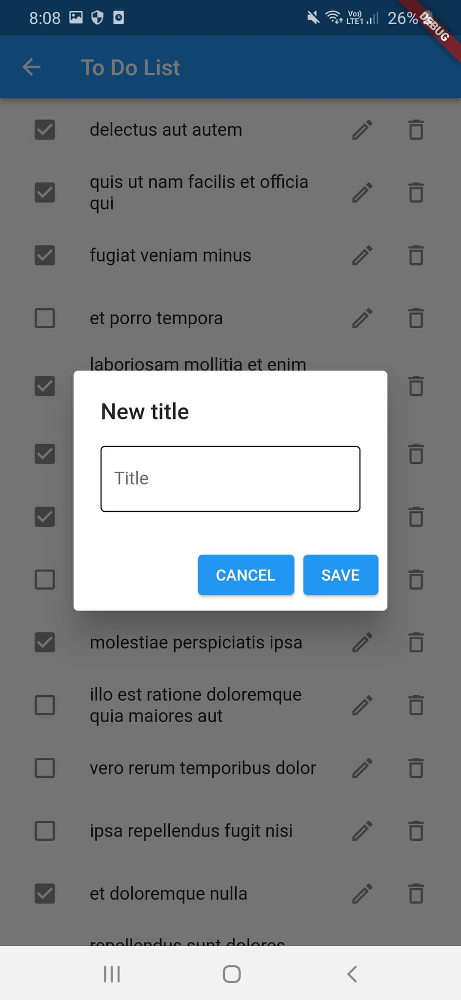
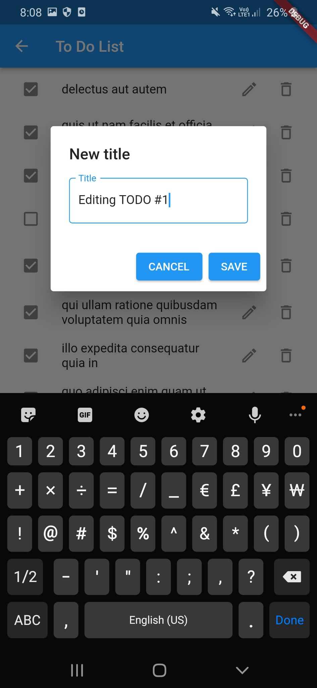
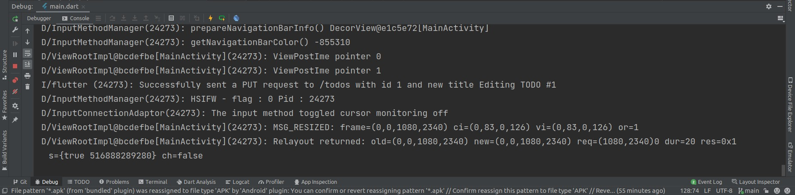
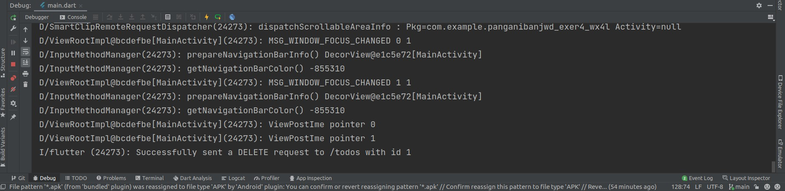
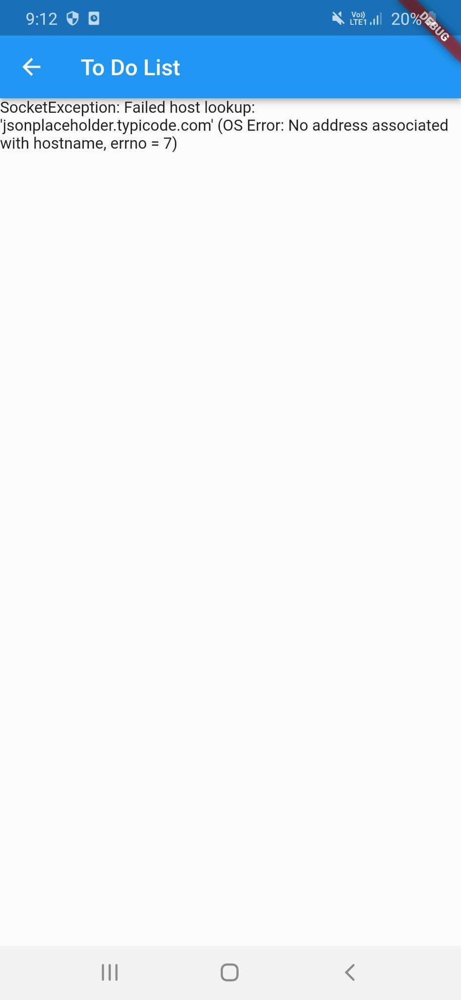

# Exercise 04 To Do App

### Jeb Wilfred D. Panganiban
### 2019-02410
### WX-4L

# Exercise Description
> A TODO app that performs HTTP requests to a mock API.
# Naming your App

```
surnameinitials_exer3_section e.g. (arriolajmt_exer3_wx1l).
```

# Documentation

- You must add screenshots of your work: Screenshots are added below.

- What did you add to the code: There was no template given, so I wrote everything myself.

- How are you able to do the exercise: By visiting the Flutter Cookbook to get an idea how to implement the different CRUD operations.

- Challenges met while doing the exercise: None

# Happy Paths

## Adding a task




### To reproduce
- Enter a task title
- Click save

### Result
- Text field will be cleared
- POST request to route /todos will be sent with the title as body

## Fetching tasks



### To reproduce
- From initial screen, click on View

### Results
- List of tasks are fetched, with checkboxes indicating whether the tasks were completed

## Updating a task




### To reproduce
- Click on the pencil icon on any task
- A popup will appear with a text field, enter new title then click on save or cancel

### Results
- If cancel is clicked, then a PUT requests will not be sent to /todos. If save is clicked, then a PUT request will be sent to /todos with the body containing the title

## Deleting a task



### To reproduce
- Click on the delete icon on any task

### Resutls
- A DELETE request will be sent to /todos with the body containing the title

# Unhappy Paths

## Fetching tasks with no internet connection




### To reproduce
- Make sure you have no internet connection, then from the initial screen, click on Save

### Results
- Error thrown was rendered on the screen

:smile_cat: contact your lab instructor if you have any concerns, inquiries or problems in your exercise.